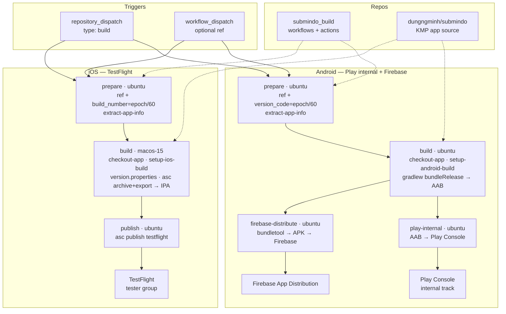

# Submindo Build Platform

CI/CD repo for building **Submindo** (KMP Compose) and publishing beta builds to testers.

| Repo | Role |
|------|------|
| `submindo_build` (this repo) | Workflows, composite actions, signing setup |
| `dungngminh/submindo` | App source code |

## CI/CD Flow



### Triggers

Both workflows accept:

- **`repository_dispatch`** (`types: [build]`) — app repo pushes SHA via dispatch
- **`workflow_dispatch`** — manual run with optional `ref` (branch / tag / SHA)

Concurrency: one run per ref; newer dispatch cancels in-progress build.

### Android → Play internal + Firebase

Workflow: `.github/workflows/build_android_app.yaml`

| Job | Runner | What it does |
|-----|--------|--------------|
| **prepare** | `ubuntu-latest` | Resolve ref, `version_code = epoch/60`, extract `VERSION_NAME` + commit message from app repo |
| **build** | `ubuntu-latest` | Checkout app, setup keystore, `gradlew :composeApp:bundleRelease` → AAB artifact |
| **play-internal** | `ubuntu-latest` | Download AAB, upload to **Play Console** (internal track) — parallel job with `firebase-distribute` |
| **firebase-distribute** | `ubuntu-latest` | Download AAB, extract universal APK (bundletool), upload to **Firebase App Distribution** |

### iOS → TestFlight

Workflow: `.github/workflows/build_ios_app.yaml`

| Job | Runner | What it does |
|-----|--------|--------------|
| **prepare** | `ubuntu-latest` | Resolve ref, `build_number = epoch/60`, extract `VERSION_NAME` + commit message |
| **build** | `macos-15` | Checkout app, setup asc CLI + signing, write `version.properties`, `asc xcode archive` + export → IPA artifact |
| **publish** | `ubuntu-latest` | `asc publish testflight` with release notes to configured tester group |

Job graph is linear (`prepare → build → publish`) because there is a single publish destination. To add parallel post-build steps later (e.g. dSYM upload to Sentry, Slack notification), create separate jobs with `needs: build` alongside `publish`.

### Composite Actions

| Action | Purpose |
|--------|---------|
| `extract-app-info` | Read `version.properties`, get commit message |
| `checkout-app` | Checkout app repo + write `local.properties` secrets |
| `setup-android-build` | Decode keystore, configure signing |
| `setup-ios-build` | asc auth, import Distribution cert, install provisioning profile |

### Versioning

- **Marketing version** (`VERSION_NAME`) — from `version.properties` in app repo
- **Build number** — `epoch seconds / 60` (monotonic, unique per re-run, fits int32)
- Android: passed via `VERSION_CODE` env to Gradle
- iOS: written to `version.properties` before archive (consumed by Xcode "Sync App Version" build phase)

### Release Notes

Auto-generated on each distribute/publish:

```
Submindo beta {version}
Build #{build_number}
Source: {ref}

Changes: {commit message}
```
